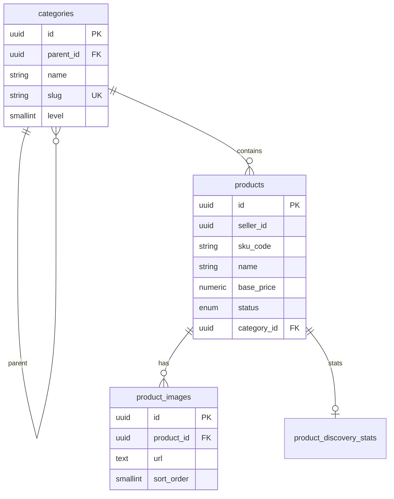
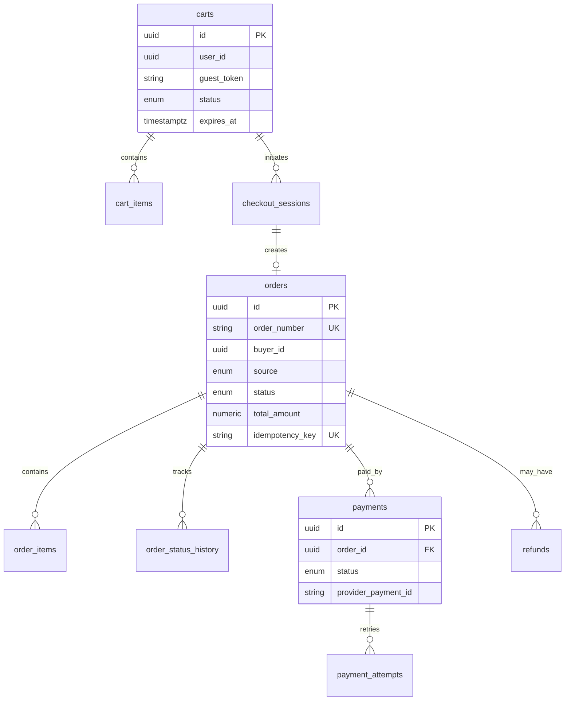
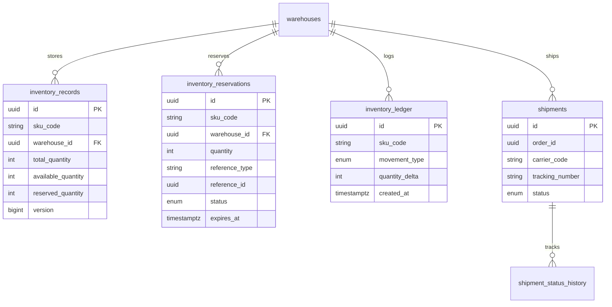
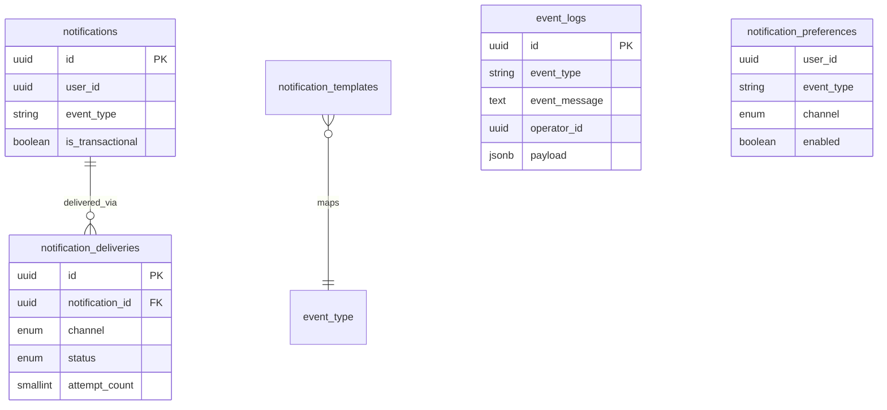

# ERD Overview — Project Nexus

Mỗi service **sở hữu database riêng** (`Nexus_*` trên SQL Server). Không có FK cross-database; chỉ lưu `UNIQUEIDENTIFIER` reference.

Schema SQL đầy đủ: `services/<service-name>/db/schema.sql`

---

## 1. User Service (`Nexus_User`)

```mermaid
erDiagram
    users ||--o{ user_roles : has
    roles ||--o{ user_roles : assigned
    roles ||--o{ role_privileges : grants
    privileges ||--o{ role_privileges : included
    users ||--o| reputation_scores : has
    users ||--o{ reputation_ratings : gives
    users ||--o{ reputation_ratings : receives
    users ||--o{ reputation_penalties : receives
    users ||--o| reputation_transaction_summary : has
    users ||--o{ user_sessions : has
    users ||--o{ password_reset_tokens : has

    users {
        uuid id PK
        string email
        string username
        string password_hash
        string full_name
        string identify_number
        enum gender
        text address
        date date_of_birth
        string status
        timestamptz deleted_at
    }

    roles {
        uuid id PK
        string code UK
        string name
        text description
    }

    privileges {
        uuid id PK
        string code UK
    }

    reputation_scores {
        uuid user_id PK_FK
        numeric score
        enum trust_level
    }
```

**Quan hệ chính:**
- `users` ↔ `roles`: N-N qua `user_roles`
- `roles` ↔ `privileges`: N-N qua `role_privileges`
- Reputation gắn 1-1 với user (`reputation_scores`)
- Rating tham chiếu `transaction_ref_id` (order/auction ID — external)

---

## 2. Catalog Service (`Nexus_Catalog`)



**Lưu ý:** `seller_id` là UUID từ User Service, không FK. `sku_code` liên kết logic với Fulfillment.

---

## 3. Commerce Service (`Nexus_Commerce`)



**Partial unique index:** chỉ 1 cart `ACTIVE` / user (`MAX_ACTIVE_CART_PER_USER=1`).

---

## 4. Auction Service (`Nexus_Auction`)

```mermaid
erDiagram
    auctions ||--o{ auction_bids : receives
    auctions ||--o{ auction_extensions : extended_by
    auctions ||--o| auction_settlements : settles

    auctions {
        uuid id PK
        uuid product_id
        uuid seller_id
        enum status
        numeric starting_price
        numeric current_price
        timestamptz scheduled_end_at
        bigint version
    }

    auction_bids {
        uuid id PK
        uuid auction_id FK
        uuid bidder_id
        numeric amount
        boolean is_winning
    }

    auction_settlements {
        uuid id PK
        uuid auction_id FK UK
        enum status
        uuid winner_id
        jsonb settlement_payload
    }
```

**Concurrency:** `auctions.version` cho optimistic locking khi đặt bid.

---

## 5. Fulfillment Service (`Nexus_Fulfillment`)



**Ràng buộc:** `total = available + reserved + unavailable` (CHECK constraint).

---

## 6. Notification Service (`Nexus_Notification`)



---

## Cross-Service References (không FK)

| Field | Owner DB | Referenced entity | Source service |
|-------|----------|-------------------|----------------|
| `products.seller_id` | catalog | User | user-service |
| `orders.buyer_id` | commerce | User | user-service |
| `auctions.product_id` | auction | Product | catalog-service |
| `inventory_reservations.reference_id` | fulfillment | Order/Checkout/Auction | commerce/auction |
| `shipments.order_id` | fulfillment | Order | commerce-service |
| `reputation_ratings.transaction_ref_id` | user | Order/Auction | commerce/auction |

**Kiểu khóa:** `UNIQUEIDENTIFIER` (SQL Server) thay cho UUID (PostgreSQL).

Validation cross-service: **sync API call** hoặc **eventual consistency qua events**.
