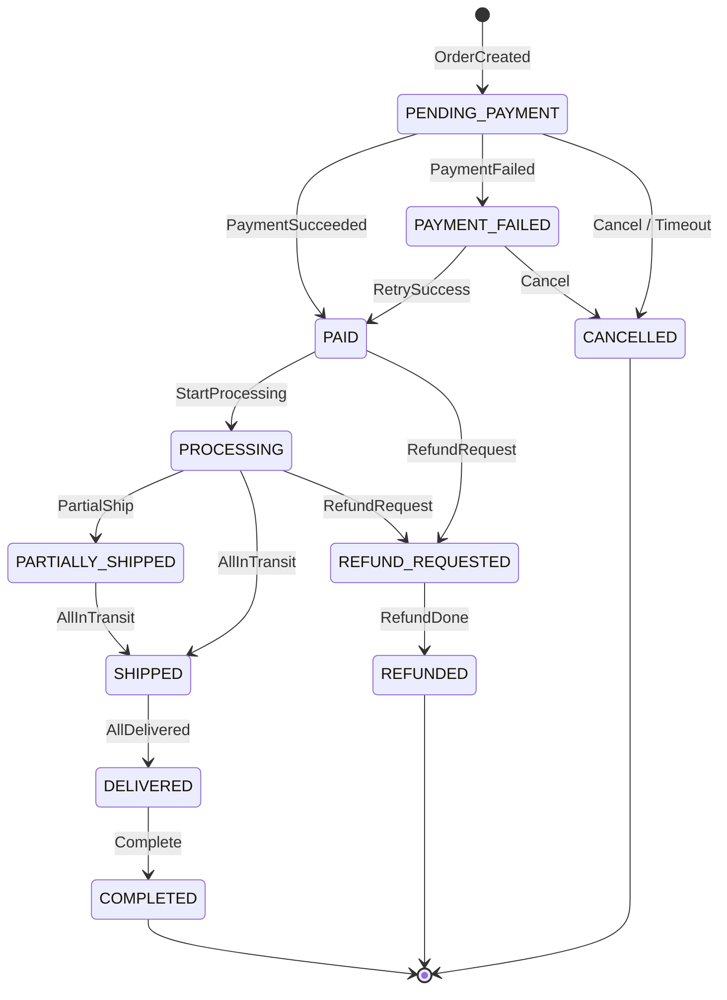
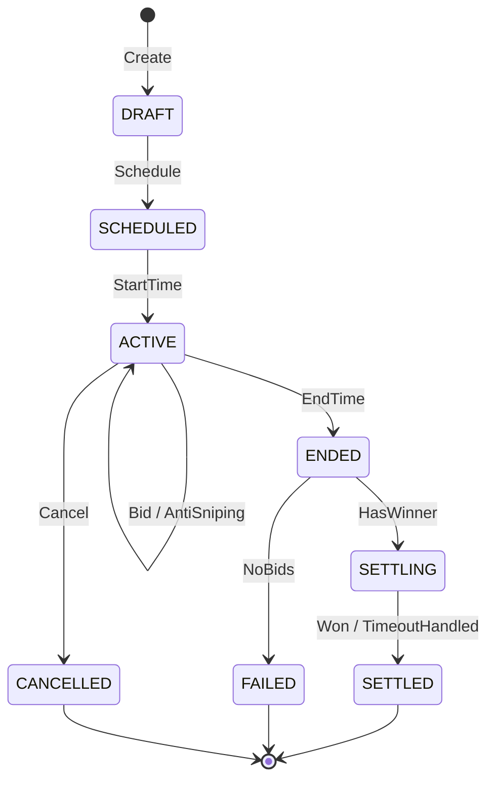
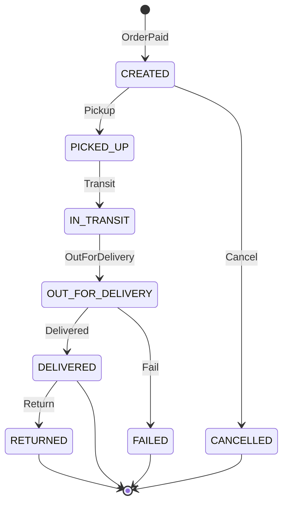

# State Machines — Order, Auction, Shipment

Định nghĩa trạng thái, transition hợp lệ, actor được phép, và event phát sinh.

---

## 1. Order State Machine

### States

| Status | Mô tả |
|--------|--------|
| `PENDING_PAYMENT` | Order đã tạo, chờ thanh toán |
| `PAID` | Thanh toán thành công |
| `PROCESSING` | Seller/warehouse đang xử lý |
| `PARTIALLY_SHIPPED` | Một phần đã giao (multi-warehouse) |
| `SHIPPED` | Tất cả shipment đã pick up / in transit |
| `DELIVERED` | Carrier xác nhận delivered |
| `COMPLETED` | Hoàn tất — cho phép rating |
| `CANCELLED` | Hủy trước/sau thanh toán (theo rule) |
| `REFUND_REQUESTED` | Yêu cầu hoàn tiền |
| `REFUNDED` | Hoàn tiền xong |
| `PAYMENT_FAILED` | Thanh toán thất bại (terminal tạm) |

### Transition Table

| From | Event / Trigger | To | Actor | Side effects |
|------|-----------------|-----|-------|--------------|
| — | `CheckoutConfirmed` / `AuctionOrderCreated` | `PENDING_PAYMENT` | System | Snapshot items, emit `OrderCreated` |
| `PENDING_PAYMENT` | `PaymentSucceeded` | `PAID` | System (Stripe webhook) | Emit `OrderPaid`; Fulfillment commit inventory |
| `PENDING_PAYMENT` | `PaymentFailed` | `PAYMENT_FAILED` | System | Emit `OrderPaymentFailed`; release reservation |
| `PENDING_PAYMENT` | `PaymentDeadlineExpired` (auction) | `CANCELLED` | System | Emit penalty event; release inventory |
| `PENDING_PAYMENT` | `CancelOrder` | `CANCELLED` | Buyer/Admin/Seller* | Release reservation |
| `PAYMENT_FAILED` | `RetryPaymentSucceeded` | `PAID` | System | — |
| `PAYMENT_FAILED` | `CancelOrder` | `CANCELLED` | Buyer/Admin | — |
| `PAID` | `StartProcessing` | `PROCESSING` | System/Seller | Fulfillment create shipment |
| `PROCESSING` | `PartialShipmentCreated` | `PARTIALLY_SHIPPED` | System | — |
| `PROCESSING` | `AllShipmentsInTransit` | `SHIPPED` | System | — |
| `PARTIALLY_SHIPPED` | `AllShipmentsInTransit` | `SHIPPED` | System | — |
| `SHIPPED` | `AllDelivered` | `DELIVERED` | System | — |
| `DELIVERED` | `ConfirmCompletion` / auto after N days | `COMPLETED` | System/Buyer | Emit `OrderCompleted`; enable rating |
| `PAID` / `PROCESSING` | `RefundRequested` | `REFUND_REQUESTED` | Buyer/Admin/Support | Emit `OrderRefundRequested` |
| `REFUND_REQUESTED` | `RefundCompleted` | `REFUNDED` | Admin/System | Emit `OrderRefundCompleted` |
| `PAID`+ | `CancelOrder` (eligible) | `CANCELLED` | Admin | Trigger refund if paid |

\*Seller cancel: chỉ khi chưa ship và business rule cho phép.

### Diagram

### Idempotency points
- Order create: `Idempotency-Key` header
- Payment webhook: `provider_payment_id` + event id
- Status transition: check current status before update (optimistic)

---

## 2. Auction State Machine

### Final states: `SETTLED`, `FAILED`, `CANCELLED`.

### States

| Status | Mô tả |
|--------|--------|
| `DRAFT` | Tạo mới, chưa schedule |
| `SCHEDULED` | Đã có start/end, chờ mở |
| `ACTIVE` | Đang nhận bid |
| `ENDED` | Hết giờ, khóa bid |
| `SETTLING` | Đang xử lý winner / no winner |
| `SETTLED` | Hoàn tất settlement |
| `FAILED` | Kết thúc không có bid hợp lệ |
| `CANCELLED` | Seller/Admin hủy |

### Transition Table

| From | Trigger | To | Actor | Side effects |
|------|---------|-----|-------:
| — | `CreateAuction` | `DRAFT` | Seller | Validate reputation, product |
| `DRAFT` | `Schedule` | `SCHEDULED` | Seller | Reserve inventory (optional); emit `AuctionScheduled` |
| `SCHEDULED` | `StartTimeReached` | `ACTIVE` | Scheduler | emit `AuctionStarted` |
| `ACTIVE` | `PlaceBid` (anti-sniping) | `ACTIVE` | Buyer | Extend end if near deadline; emit `BidPlaced`, maybe `Outbid` |
| `ACTIVE` | `CancelAuction` | `CANCELLED` | Seller/Admin | emit `AuctionCancelled`; release inventory |
| `ACTIVE` | `EndTimeReached` | `ENDED` | Scheduler | Lock bids; emit `AuctionEnded` |
| `ENDED` | `DetermineWinner` (has bids) | `SETTLING` | System | — |
| `ENDED` | `DetermineWinner` (no bids) | `FAILED` | System | emit `AuctionFailed`; release inventory |
| `SETTLING` | `SettlementComplete` (winner) | `SETTLED` | System | emit `AuctionWon`; send payload to Commerce |
| `SETTLING` | `PaymentTimeout` | `SETTLED`* | System | emit `AuctionPaymentTimeout`; penalty |
| `FAILED` | — | — | — | Terminal |
| `CANCELLED` | — | — | — | Terminal |
| `SETTLED` | — | — | — | Terminal |

\*Hoặc sub-state `PAYMENT_TIMEOUT` trong settlement — tùy implementation; SRS yêu cầu penalty + event.

**Configure auction:** chỉ khi `DRAFT` hoặc `SCHEDULED` (trước `ACTIVE`).

**Bid validation (stays in ACTIVE):**
- Auction active
- `bid >= current_price + increment`
- Bidder reputation >= `MIN_REPUTATION_TO_BID`
- Atomic update with `version`

### Diagram

---

## 3. Shipment State Machine

### States (internal — mapped from carrier)

| Status | Mô tả |
|--------|--------|
| `CREATED` | Shipment record tạo sau OrderPaid |
| `PICKED_UP` | Carrier đã lấy hàng |
| `IN_TRANSIT` | Đang vận chuyển |
| `OUT_FOR_DELIVERY` | Đang giao |
| `DELIVERED` | Giao thành công |
| `FAILED` | Giao thất bại |
| `RETURNED` | Hoàn trả |
| `CANCELLED` | Hủy shipment |

### Transition Table

| From | Trigger | To | Actor | Event |
|------|---------|-----|-------|-------|
| — | `OrderPaid` + create shipment | `CREATED` | Fulfillment | `ShipmentCreated` |
| `CREATED` | Carrier pickup callback | `PICKED_UP` | Carrier/System | `ShipmentPickedUp` |
| `PICKED_UP` | In transit update | `IN_TRANSIT` | Carrier | `ShipmentInTransit` |
| `IN_TRANSIT` | Out for delivery | `OUT_FOR_DELIVERY` | Carrier | — |
| `OUT_FOR_DELIVERY` | Delivered | `DELIVERED` | Carrier | `ShipmentDelivered` → trigger Order status |
| `*` | Delivery failed | `FAILED` | Carrier | `ShipmentFailed` |
| `DELIVERED` | Return initiated | `RETURNED` | Carrier/Admin | `ShipmentReturned` |
| `CREATED` | Manual cancel | `CANCELLED` | Admin/Seller | — |
| `*` | `SHIPPING.MANUAL_OVERRIDE` | `*` | Admin/Support | Audit log |

### Carrier status mapping (example)

| GHN/GHTK raw | Internal |
|--------------|----------|
| `ready_to_pick` | `CREATED` |
| `picking` / `picked` | `PICKED_UP` |
| `transporting` | `IN_TRANSIT` |
| `delivering` | `OUT_FOR_DELIVERY` |
| `delivered` | `DELIVERED` |
| `delivery_fail` | `FAILED` |
| `return` | `RETURNED` |

### Diagram

### Retry / resilience
- Carrier API timeout: 3000ms, retry 3 (`SHIPPING_RETRY_LIMIT`)
- Circuit breaker per carrier — không block order processing
- Status updates: **idempotent** by `(shipment_id, carrier_status, timestamp)`

---

## Implementation notes

1. Lưu mọi transition vào `*_status_history` tables.
2. Reject invalid transitions tại service layer (không chỉ DB).
3. Publish domain event **sau commit** (transactional outbox).
4. Consumer downstream chỉ re-act, không điều khiển state machine trực tiếp trừ khi là owner.
